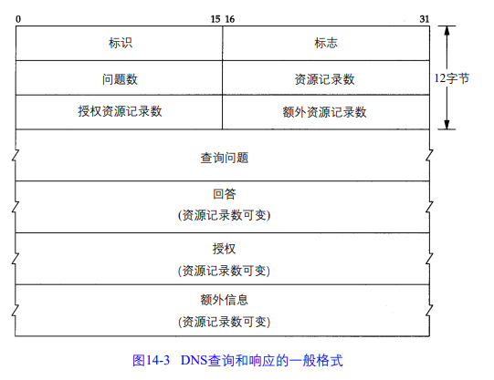
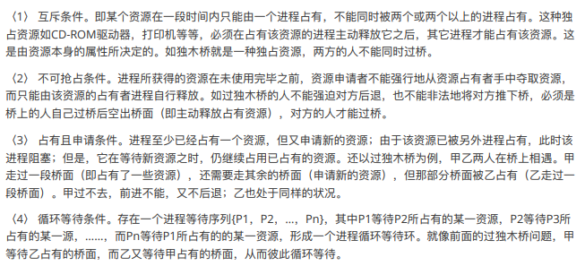
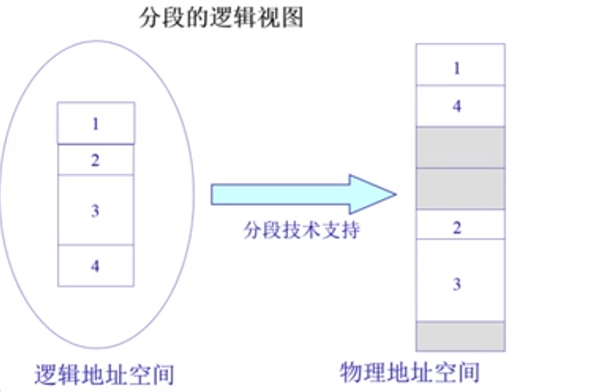
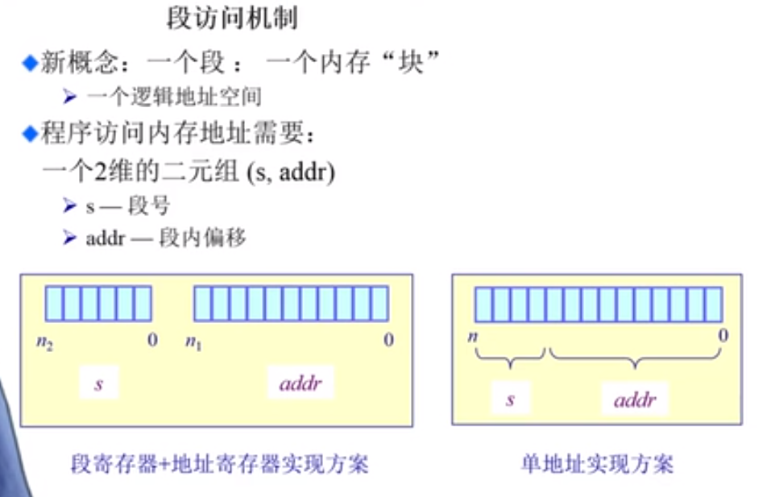

## C++面经大纲

### C++基础知识

#### 基础语法

const的作用

> 1. 修饰变量，说明该变量不可以被改变；
> 2. 修饰指针，分为指向常量的指针和指针常量；
> 3. 常量引用，经常用于形参类型，即避免了拷贝，又避免了函数对值的修改；
> 4. 修饰成员函数，说明该成员函数内不能修改成员变量

static的作用:

>1. 修饰普通变量，修改变量的存储区域和生命周期，使变量存储在静态区，在main函数运行前就分配了空间，如果有初始值就用初始值初始化它，如果没有初始值系统用默认值初始化它。
>2. 修饰普通函数，表明函数的作用范围，仅在定义该函数的文件内才能使用。在多人开发项目时，为了防止与他人命令函数重名，可以将函数定位为static。
>3. 修饰成员变量，修饰成员变量使所有的对象只保存一个该变量，而且不需要生成对象就可以访问该成员。
>4. 修饰成员函数，修饰成员函数使得不需要生成对象就可以访问该函数，但是在static函数内不能访问非静态成员

#pragmapack(n)

> 设定结构体、联合以及类成员变量以n字节方式对齐
>
> ```c++
> #pragmapack(push)//保存对齐状态
> #pragmapack(4)//设定为4字节对齐
> structtest
> {
>    charm1;
>    doublem4;
>    intm3;
> };
> #pragmapack(pop)//恢复对齐状态
> ```

volatile

>- volatile关键字是一种类型修饰符，用它声明的类型变量表示可以被某些编译器未知的因素（操作系统、硬件、其它线程等）更改。所以使用volatile告诉编译器不应对这样的对象进行优化。
>- volatile关键字声明的变量，每次访问时都必须从内存中取出值（没有被volatile修饰的变量，可能由于编译器的优化，从CPU寄存器中取值）
>- const可以是volatile（如只读的状态寄存器）
>- 指针可以是volatile

extern"C"

> - 被extern限定的函数或变量是extern类型的
> - 被`extern"C"`修饰的变量和函数是按照C语言方式编译和连接的
>
> `extern"C"`的作用是让C++编译器将`extern"C"`声明的代码当作C语言代码处理，可以避免C++因符号修饰导致代码不能和C语言库中的符号进行链接的问题。
>
> ```c++
> #ifdef__cplusplus
> extern"C"{
> #endif
> void*memset(void*,int,size_t);
> #ifdef__cplusplus
> }
> #endif
> ```

C++struct和class的区别

>总的来说，struct更适合看成是一个数据结构的实现体，class更适合看成是一个对象的实现体。
>
>最本质的一个区别就是默认的访问控制
>
>1. 默认的继承访问权限。struct是public的，class是private的。
>2. struct作为数据结构的实现体，它默认的数据访问控制是public的，而class作为对象的实现体，它默认的成员变量访问控制是private的。

expliciit关键字

> - explicit修饰构造函数时，可以防止隐式转换和复制初始化
> - explicit修饰转换函数时，可以防止隐式转换，但[按语境转换](https://zh.cppreference.com/w/cpp/language/implicit_conversion)除外


空类占用内存大小

> 1个字节

------

智能指针：

> auto_ptr：
>
> shared_ptr：
>
> unique_ptr：
>
> weak_ptr：

------

weak_ptr如何转shared_ptr?

>

------

C++的四种类型转换

>使用C风格的类型转换可以把想要的任何东西转换成我们需要的类型，但是这种类型转换太过松散，对于这种松散的情况，C++提供了更严格的类型转换，可以提供更好的控制转换过程，并添加4个类型转换运算符，使转换过程更规范：static_cast、dynamic_cast、const_cast、reinterpret_cast。
>
>static_cast静态转换
>
>用于类层次结构中基类（父类）和派生类（子类）之间指针或引用的转换
>
>o进行上行转换（把派生类的指针或引用转换成基类表示）是安全的
>
>o进行下行转换（把基类指针或引用转换成派生类表示）时，由于没有动态类型检查，所以是不安全的
>
>用于基本数据类型之间的转换，如把int转换成char，把char转换成int。这种转换的安全性也要开发人员来保证
>
>dynamic_cast动态转换
>
>dynamic_cast主要用于类层次间的上行转换和下行转换
>
>在类层次间进行上行转换时，dynamic_cast和static_cast的效果是一样的
>
>在进行下行转换时，dynamic_cast具有类型检查的功能，比static_cast更安全
>
>const_cast常量转换
>
>该运算符用来修改类型的const属性
>
>常量指针被转化成非常量指针，并且仍然指向原来的对象
>
>常量引用被转换成非常量引用，并且仍然指向原来的对象
>
>注意:不能直接对非指针和非引用的变量使用const_cast操作符
>
>reinterpret_cast重新解释转换
>
>这是最不安全的一种转换机制，最有可能出问题
>
>主要用于将一种数据类型从一种类型转换为另一种类型，它可以将一个指针转换成一个整数，也可以将一个整数转换成一个指针

------

C++中的内存对齐

>主要就是struct的那一块。
>
>对于32位来说默认四字节对齐
>
>对于64位来说采用八字节对齐

------

简述一下C++从代码到可执行二进制文件的过程

>标准回答
>
>C++从代码到可执行二进制文件经过四个过程，分别是：预编译、编译、汇编、链接。
>
>1. 预编译，主要的处理操作：
>
>    a.将所有的#define删除，并且展开所有的宏定义（宏替换）
>
>    b.处理所有的条件预编译指令，如#if、#ifdef
>
>    c.处理#include预编译指令，将被包含的文件插入到该预编译指令的位置
>
>    d.删除所有的注释
>
>    e.添加行号和文件名标识
>
>2. 编译：将预处理之后的代码转换成特定的汇编代码，主要包括词法分析、语法分析、语义分析、优化代码等操作
>
>3. 汇编：将汇编代码汇编成机器指令
>
>4. 链接：将不同源文件生成的目标代码以及其它目标代码、库文件组合起来，从而形成可执行程序
>
>加分回答
>
>链接分为静态链接和动态链接。
>
>1. 静态链接：静态链接是由链接器在链接时将库的内容加入到可执行程序中，将一个或多个库或目标文件（先前由编译器或汇编器生成）链接到一块生成可执行程序。
>
>2. 动态链接：动态链接在链接后动态库仍然与可执行文件分离，直到运行时才动态加载。

#### 面向对象

简述一下C++中的多态

>标准回答
>
>在现实生活中，多态是同一个事物在不同场景下的多种形态。在面向对象中，多态是指通过基类的指针或者引用，在运行时动态调用实际绑定对象函数的行为，与之相对应的编译时绑定函数称为静态绑定。所以多态分为静态多态和动态多态。
>
>1. 静态多态
>
>    静态多态是编译器在编译期间完成的，编译器会根据实参类型来选择调用合适的函数，如果有合适的函数就调用，没有的话就会发出警告或者报错。静态多态有函数重载、运算符重载、泛型编程等。
>
>2. 动态多态
>
>    动态多态是在程序运行时根据基类的引用（指针）指向的对象来确定自己具体该调用哪一个类的虚函数。当父类指针（引用）指向父类对象时，就调用父类中定义的虚函数；即当父类指针（引用）指向子类对象时，就调用子类中定义的虚函数。
>
>加分回答
>
>1. 动态多态行为的表现效果为：同样的调用语句在实际运行时有多种不同的表现形态。
>
>2. 实现动态多态的条件：
>
>    o要有继承关系
>
>    o要有虚函数重写（被virtual声明的函数叫虚函数）
>
>    o要有父类指针（父类引用）指向子类对象
>
>3. 动态多态的实现原理
>
>    当类中声明虚函数时，编译器会在类中生成一个虚函数表，虚函数表是一个存储类虚函数指针的数据结构，虚函数表是由编译器自动生成与维护的。virtual成员函数会被编译器放入虚函数表中，存在虚函数时，每个对象中都有一个指向虚函数表的指针（vptr指针）。在多态调用时,vptr指针就会根据这个对象在对应类的虚函数表中查找被调用的函数，从而找到函数的入口地址。


说一说C++中哪些不能是虚函数

>C++中，普通函数（非成员函数）、构造函数、友元函数、静态成员函数、内联成员函数这些不能是虚函数。
>
>1.普通函数（非成员函数）
>
>2.构造函数
>
>3.友元函数
>
>4.静态成员函数
>
>5.内联成员函数

------

虚函数表运行时加载在虚拟地址空间的哪里？

> .rodata数据段

------


#### STL

STL的六大组件：

>容器：各种数据结构
>
>算法：字面意思 算法函数库
>
>迭代器：用于遍历容器的一种指针，容器与算法的胶合剂
>
>适配器：修饰容器或仿函数的或迭代器的接口的东西。如stack、queue
>
>仿函数：作为算法策略
>
>分配器：负责为容器分配内存空间

STL常用容器

>STL中容器分为顺序容器、关联式容器、容器适配器三种类型，三种类型容器特性分别如下：
>
>1、顺序容器
>
>容器并非排序的，元素的插入位置同元素的值无关，包含vector、deque、list。
>
>vector：动态数组
>
>元素在内存连续存放。随机存取任何元素都能在常数时间完成。在尾端增删元素具有较佳的性能。
>
>deque：双向队列
>
>元素在内存连续存放。随机存取任何元素都能在常数时间完成（仅次于vector）。在两端增删元素具有较佳的性能（大部分情况下是常数时间）。
>
>list：双向链表
>
>元素在内存不连续存放。在任何位置增删元素都能在常数时间完成。不支持随机存取。
>
>2、关联式容器
>
>元素是排序的；插入任何元素，都按相应的排序规则来确定其位置；在查找时具有非常好的性能；通常以平衡二叉树的方式实现，包含set、multiset、map、multimap。
>
>set/multiset
>
>set中不允许相同元素，multiset中允许存在相同元素。
>
>map/multimap
>
>map与set的不同在于map中存放的元素有且仅有两个成员变，一个名为first，另一个名为second，map根据first值对元素从小到大排序，并可快速地根据first来检索元素。map和multimap的不同在于是否允许相同first值的元素。
>
>3、容器适配器
>
>封装了一些基本的容器，使之具备了新的函数功能，包含stack、queue、priority_queue。
>
>stack：栈
>
>栈是项的有限序列，并满足序列中被删除、检索和修改的项只能是最进插入序列的项（栈顶的项），后进先出。
>
>queue：队列
>
>插入只可以在尾部进行，删除、检索和修改只允许从头部进行，先进先出。
>
>priority_queue：优先级队列
>
>内部维持某种有序，然后确保优先级最高的元素总是位于头部，最高优先级元素总是第一个出列。

------

#### C++11

sharedptr的引用计数对象在哪里？栈上还是堆上

> 堆

unique-ptr和scoped-ptr什么区别？

> 就比uniqueptr少了那个带右值引用的拷贝构造和重载赋值。

实现getSharedPtr让使技术引用为2

> ```cpp
> #include<iostream>
> #include<memory>
> usingnamespacestd;
> /*代码*/
> classA:publicenable_shared_from_this<A>{
> public:
>    shared_ptr<A>getSharedPtr()
>    {
>    returnshared_from_this();
>    }
>    };
> intmain()
> {
>    shared_ptr<A>ptr1(newA());
>    shared_ptr<A>ptr2=ptr1->getSharedPtr();
>    cout<<ptr1.use_count()<<endl;
>    cout<<ptr2.use_count()<<endl;
>    return0;
>    }
>    ```

简述一下C++11中auto的用法

> 标准回答
>
> 1. 实现自动类型推断，要求进行显示初始化，让编译器能够将变量的类型设置为初始值的类型：
>
> > autoa=12;//a为int类型
> >
> > autopt=&a;//pt为int*类型
> >
> >  
> >
> > doublefm(doublea,intb){
> >
> >   returna+b;
> >
> > }
> >
> > autopf=fm;//pf为double类型
>
> 2. 简化模板声明
>
> > for(std::initializer_list<double>::iteratorp=il.begin();p!=il.end();p++)
> >
> > for(autop=il.begin();p!=il.end();p++)

### linux

进程间通信的方式？

>1、无名管道
>
>2、有名管道
>
>3、消息队列
>
>4、信号量数组
>
>5、共享内存
>
>6、socket通信


- IO多路复用

    > - 什么是IO多路复用?
    >
    > ​	IO多路复用可以同时监听多个文件描述符，能够提高程序的性能，linux下实现I/O多路复用的系统调用主要有：select、poll、epoll。
    >
    > - IO模型：
    >
    >     - 阻塞等待（BIO）：
    >
    >         基本的read、write，采用多线程或者多进程解决
    >
    >         缺点：1、线程或者进程会消耗资源；2、线程或进程调度消耗CPU资源
    >
    >     - 非阻塞，忙轮询（NIO模型）：
    >
    >         提高了程序的执行效率，采用IO多路复用解决。
    >
    >         缺点：需要占用更多的CPU和系统资源。
    >
    > 	- 多路复用IO
    >
    > 	    - select：
    >
    > 	        > 主旨思想：
    > 	        >
    > 	        > 1. 首先要构造一个关于文件描述符的列表，将要监听的文件描述符添加到该列表中。
    > 	        >
    > 	        > 2. 调用一个系统函数，监听该列表中的文件描述符，直到这些描述符中的一个或者多个进行I/O操作时，该函数才返回。
    > 	        >
    > 	        >     a.这个函数是阻塞
    > 	        >
    > 	        >     b.函数对文件描述符的检测的操作是由内核完成的
    > 	        >
    > 	        > 3. 在返回时，它会告诉进程有多少（哪些）描述符要进行I/O操作。
    > 	        >
    > 	        > 缺点：
    > 	        >
    > 	        > - 每次要将fdset从用户态拷贝到内核态，当fd比较多这个开销会很大。
    > 	        > - 内核需要遍历所有文件描述符，在文件描述符很多的时候开销比较大。
    > 	        > - select支持的文件描述符数量太少，默认是1024。
    > 	        > - fds集合不能重用每次都要重置。
    >
    > 	    - poll
    >
    > 	        > ```cpp
    > 	        > #include<poll.h>
    > 	        > structpollfd{
    > 	        > intfd;/*委托内核检测的文件描述符*/
    > 	        > shortevents;/*委托内核检测文件描述符的什么事件*/
    > 	        > shortrevents;/*文件描述符实际发生的事件*/
    > 	        > };
    > 	        > structpollfdmyfd;
    > 	        > myfd.fd=5;
    > 	        > myfd.events=POLLIN|POLLOUT;
    > 	        > intpoll(structpollfd*fds,nfds_tnfds,inttimeout);
    > 	        > -参数：
    > 	        > 	-fds:是一个structpollfd结构体数组，这是一个需要检测的文件描述符的集合
    > 	        > 	-nfds:这个是第一个参数数组中最后一个有效元素的下标+1
    > 	        > 	-timeout:阻塞时长
    > 	        > 		0:不阻塞
    > 	        > 		-1:阻塞，当检测到需要检测的文件描述符有变化，解除阻塞
    > 	        > 		>0:阻塞的时长
    > 	        > -返回值：
    > 	        > 	-1:失败
    > 	        > 	>0（n）:成功,n表示检测到集合中有n个文件描述符发生变化
    > 	        > ```
    > 	        >
    > 	        > 
    >
    > 	    - epoll
    >
    > 	        > 1、采用红黑树
    > 	        >
    > 	        > 2、epoll底层在内核中，减少了用户态到内核态拷贝的动作。
    > 	        >
    > 	        > ```cpp
    > 	        > include<sys/epoll.h>
    > 	        > //创建一个新的epoll实例。在内核中创建了一个数据，这个数据中有两个比较重要的数据，一个是需要检
    > 	        > 测的文件描述符的信息（红黑树），还有一个是就绪列表，存放检测到数据发送改变的文件描述符信息（双向链表）。
    > 	        > intepoll_create(intsize);
    > 	        > 	-参数：
    > 	        > 		size:目前没有意义了。随便写一个数，必须大于0
    > 	        > 	-返回值：
    > 	        > -1:失败
    > 	        > >0:文件描述符，操作epoll实例的
    > 	        > 
    > 	        > typedef  union epoll_data{
    > 	        >     void*ptr;
    > 	        >     intfd;
    > 	        >     uint32_tu32;
    > 	        >     uint64_tu64;
    > 	        > }epoll_data_t;
    > 	        > struct epoll_event{
    > 	        > uint32 _tevents;/*Epollevents*/
    > 	        > epoll_data _tdata;/*Userdatavariable*/
    > 	        > };
    > 	        > 常见的Epoll检测事件：
    > 	        > -EPOLLIN
    > 	        > -EPOLLOUT
    > 	        > -EPOLLERR
    > 	        > //对epoll实例进行管理：添加文件描述符信息，删除信息，修改信息
    > 	        > intepoll_ctl(intepfd,intop,intfd,structepoll_event*event);
    > 	        > -参数：
    > 	        > -epfd:epoll实例对应的文件描述符
    > 	        > -op:要进行什么操作
    > 	        > EPOLL_CTL_ADD:添加
    > 	        > EPOLL_CTL_MOD:修改
    > 	        > EPOLL_CTL_DEL:删除
    > 	        > -fd:要检测的文件描述符
    > 	        > -event:检测文件描述符什么事情
    > 	        > //检测函数
    > 	        > int epoll_wait(int epfd,struct epoll_event* events,int maxevents,int timeout);
    > 	        > -参数：
    > 	        > -epfd:epoll实例对应的文件描述符
    > 	        > -events:传出参数，保存了发送了变化的文件描述符的信息
    > 	        > -maxevents:第二个参数结构体数组的大小
    > 	        > -timeout:阻塞时间
    > 	        > -0:不阻塞
    > 	        > -1:阻塞，直到检测到fd数据发生变化，解除阻塞
    > 	        > ->0:阻塞的时长（毫秒）
    > 	        > -返回值：
    > 	        > -成功，返回发送变化的文件描述符的个数>0
    > 	        > -失败-1
    > 	        > ```
    > 	        >
    > 	        > - 水平触发LT：
    > 		    >
    > 	        >     > 
    > 	        >
    > 	        > - 边沿触发ET：
    > 	        >
    > 	        >     >
    >
    > 
    >
    > 

    用户态协议栈：

    > 

### 设计模式


### 计算机网络

面经链接：https://www.nowcoder.com/discuss/839894

https://www.cnblogs.com/winlsr/p/15094958.html

#### 网络基础

OSI七层模型

> OSI模型（OpenSystemInterconnectionModel）是⼀个由ISO提出得到概念模型，试图提供⼀个使各种不同的的计算机和⽹络在世界范围内实现互联的标准框架。
>
> | 网络层次 | 常用协议 | 传输方式 |功能|
> | :------- | ----------------------- | -------- |------|
> | 应用层   | HTTP、SMTP、FTP、TELNET |  |这⼀层为操作系统或⽹络应⽤程序提供访问⽹络服务的接⼝。|
> | 表示层   |                         |  |使通信的应用程序能够解释交换数据的含义，说图像、视频编码解，数据加密。|
> | 会话层   | SSL、TLS                |          |管理主机之间的会话进程，即负责建⽴、管理、终⽌进程之间的会话|
> | 运输层   | TCP、UDP                | 数据段 ||
> | 网络层   | IP、ARP、ICMP、IGMP     | 数据包 ||
> | 链路层   |                         | 将bit流封装成frame帧 |不可靠的物理介质上提供可靠的传输。|
> | 物理层   |                         | bit流 |确保原始的数据可在各种物理媒体上传输|
>
> 

#### 网络层

> IP协议
>
> IP地址划分
>
> DHCP协议
>
> ICMP协议
>
> > - 功能：ICMP经常被认为是IP层的一个组成部分。它传递差错报文以及其他需要注意的信息。
> > - 类型：
> >     - ICMP差错报文
> >     - ICMP询问报文
> > - 以下情况不会产生ICMP报文
> >     - ICMP差错报文
> >     - 目的地址是广播地址
> >     - 作为链路层广播的数据报
> >     - 不是IP分片的第一片
> >     - 原地址不是单个主机的数据报。
>
> IP转发
>
> ARP协议
>
> > - 功能：从逻辑Internet地址到对应的物理硬件地址需要进行翻译。
> >
> > - 请求协议格式：
> >
> >     。。。
> >
> > - 对不存在的主机发送一个ARP请求：
> >
> >     我们通过telnet测试会发现我们会看到多次arp的请求这是tcp协议重传机制造成的默认时长设置为30s，但实际上有些会设置为75秒。arp-a发现不存在主机返回iocomplete
> >
> > - ARP高速缓存
> >
> >     - 一般来说arp缓存设置超时为20分钟。
> >     - ARP高效运行的关键是由于每个主机上都有一个ARP高速缓存。这个高速缓存存放了最近Internet地址到硬件地址之间的映射记录。
> >     - 可以采用arp-a来查看浏览器缓存
> >
> > - ARP代理
> >
> >     > 如果ARP请求是从一个网络的主机发往另一个网络上的主机，那么连接这两个网络的路由器就可以回答该请求，这个过程称作委托ARP或ARP代理(ProxyARP)。这样可以欺骗发起ARP请求的发送端，使它误以为路由器就是目的主机，而事实上目的主机是在路由器的“另一边”。路由器的功能相当于目的主机的代理，把分组从其他主机转发给它。
>

NAT分类：

> - 锥形NAT:原IP相同的情况下，多个目的IP不同，但是转换的是相同的
>     - 限制锥形:
>         - 端口限制锥形NAT：只有固定的IP + 端口（也就是进程）才能被访问
>         - IP限制锥形NAT：只有固定的IP才能访问
>     - 完全锥形:不对访问请求做限制，能找到IP + 端口就可以收到
> - 对称NAT:

#### 传输层

运输层的功能？

> 运输层协议会运行在不同主机上的应用进程提供逻辑通信的功能*/

多路复用和多路分解：

> 多路分解：将运输层中的数据交付到正确的套接字的工作被称为多路分解
>
> 多路复用：从源主机不同套接字收集的数据块，并为每个数据块封装首部信息，从而生成的报文段，将报文段传递给网络成为多路复用。

TCP和UDP的区别

>1、从首部来看：UDP只占8个字节而TCP占20个字节
>
>2、从连接来看：TCP是面向连接的而UDP无连接
>
>3、从发送数据类型来看：UDP发送的是数据报，而TCP发送的是字节流
>
>4、从数据安全来看：TCP保证数据正确性，UDP可能丢包
>
>5、TCP保证数据顺序，UDP不保证。


UDP协议介绍:

> UDP数据报由20的IP首部(伪首部)+8的UDP首部（源端口16|目的端口16|UDP长度（**指的是首部+数据总长度最小为8个字节**）16|UDP检验和16）+数据
>
> **由于IP层已经把IP数据报分配给TCP或UDP（根据IP首部中协议字段值），因此TCP端口号由TCP来查看，而UDP端口号由UDP来查看。TCP端口号与UDP端口号是相互独立的。**
>
> UDP检验和：**如果发送端没有计算检验和而接收端检测到检验和有差错，那么UDP数据报就要被悄悄地丢弃。不产生任何差错报文（当IP层检测到IP首部检验和有差错时也这样做）。**
>
> 如何知道是否打开了UDP检验和：可以采用tcpdump

有些应用更适合udp的原因：

> - 关于发送什么数据以及何时发送的应用层更为精细，有些应用可以容忍一些数据丢失。
> - 无需建立连接
> - 无连接状态
> - 分组首部开销小

在应用层UDP实现可靠数据传输的优势

> 在udp实现可靠数据传输，可以通过应用层中建立可靠传输机制来完成。（如增加ue任浩宇重传机制）（例如google的QUIC协议），这样的好处是无需受制于TCP拥塞控制强加的传输数率限制。

为什么UDP需要提供检验和机制

> 其原因是不能保证源和目的之间的所有链路都提供差错检错。此外及时报文链路正确，但可能在某台路由器的内存中，引入了比特差错。在既无法确保链路可靠，又不能确保内存中的差错检错的情况下，如果要提供差错检错udp就必须在运输层实现差错检测，这一做法符合端到端原则。
>
> **端到端原则：因为某种功能必须基于端到端实现：“在较高级别提供这些功能的代价相比，在较低级别设置的功能可能是冗余或几乎没有价值的”。**
>
> 虽然udp提供差错检错机制，但是其没有差错恢复能力。


TCP协议介绍：

> TCP向应用层提供一种可靠的面向连接的字节流服务。

TCP如何保证可靠性？

> - 应用数据被分割成TCP认为最适合发送的数据块。
> - 当TCP发出一个段后，它启动一个定时器，等待目的端确认收到这个报文段。如果不能及时收到一个确认，将重发这个报文段。
> - 当TCP收到发自TCP连接另一端的数据，它将发送一个确认。
> - TCP将保持它首部和数据的检验和。
> - 如果必要，TCP将对收到的数据进行重新排序，将收到的数据以正确的顺序交给应用层。
> - 既然IP数据报会发生重复，TCP的接收端必须丢弃重复的数据。
> - TCP还能提供流量控制。

TCP的可靠传输机制

> 流量控制、序号、确认、定时器

三次握手：

> - 第⼀次：客户端发含SYN位，SEQ_NUM=S的包到服务器。（客->SYN_SEND）
>- 第⼆次：服务器发含ACK，SYN位且ACK_NUM=S+1，SEQ_NUM=P的包到客户机。（服->SYN_RECV）
> - 第三次：客户机发送含ACK位，ACK_NUM=P+1的包到服务器。（客->ESTABLISH，服->ESTABLISH)

序列号如何确定：


四次挥手：

> - 第⼀次：客户机发含FIN位，SEQ=Q的包到服务器。（客->FIN_WAIT_1）
> - 第⼆次：服务器发送含ACK且ACK_NUM=Q+1的包到服务器。（服->CLOSE_WAIT，客->FIN_WAIT_2）此处有等待
> - 第三次：服务器发送含FIN且SEQ_NUM=R的包到客户机。（服->LAST_ACK，客->TIME_WAIT）此处有等待
> - 第四次：客户机发送最后⼀个含有ACK位且ACK_NUM=R+1的包到客户机。（服->CLOSED）

为什么握⼿是三次，挥⼿是四次？

> 对于握⼿：握⼿只需要确认双⽅通信时的初始化序号，保证通信不会乱序。（第三次握⼿必要性：假设服务端的确认丢失，连接并未断开，客户机超时发连接请求，这样服务器会对同⼀个客户机保持多个连接，造成资源浪费。）
>
>  对于挥⼿：TCP是双⼯的，所以发送⽅和接收⽅都需要FIN和ACK。只不过有⼀⽅是被动的，所以看上去就成了4次挥⼿。同时当一方发送FIN后，另外一方可能还有数据要发送，只有等到另外一方也把数据发送完毕的情况下才能发送ACK

TCP连接状态？

> - CLOSED：初始状态。
>
> - LISTEN：服务器处于监听状态。
> - SYN_SEND：客户端socket执⾏CONNECT连接，发送SYN包，进⼊此状态。
> - SYN_RECV：服务端收到SYN包并发送服务端SYN包，进⼊此状态。
> - ESTABLISH：表示连接建⽴。客户端发送了最后⼀个ACK包后进⼊此状态，服务端接收到ACK包后进⼊此状态。
> -  FIN_WAIT_1：终⽌连接的⼀⽅（通常是客户机）发送了FIN报⽂后进⼊。等待对⽅FIN。
> - CLOSE_WAIT：（假设服务器）接收到客户机FIN包之后等待关闭的阶段。在接收到对⽅的FIN包之后，⾃然是需要⽴即回复ACK包的，表示已经知道断开请求。但是本⽅是否⽴即断开连接（发送FIN包）取决于是否还有数据需要发送给客户端，若有，则在发送FIN包之前均为此状态。
> - FIN_WAIT_2：此时是半连接状态，即有⼀⽅要求关闭连接，等待另⼀⽅关闭。客户端接收到服务器的ACK包，但并没有⽴即接收到服务端的FIN包，进⼊FIN_WAIT_2状态。
> - LAST_ACK：服务端发动最后的FIN包，等待最后的客户端ACK响应，进⼊此状态。
> - TIME_WAIT：客户端收到服务端的FIN包，并⽴即发出ACK包做最后的确认，在此之后的2MSL时间称为TIME_WAIT状态。

解释FIN_WAIT_2，CLOSE_WAIT状态和TIME_WAIT状态

> - FIN_WAIT_2：
>     - 半关闭状态。
>     -  发送断开请求⼀⽅还有接收数据能⼒，但已经没有发送数据能⼒。
>
> - CLOSE_WAIT状态：
>     - 被动关闭连接⼀⽅接收到FIN包会⽴即回应ACK包表示已接收到断开请求。
>     - 被动关闭连接⼀⽅如果还有剩余数据要发送就会进⼊CLOSED_WAIT状态。
>
> - TIME_WAIT状态：
>     -  ⼜叫2MSL等待状态。
>     - 如果客户端直接进⼊CLOSED状态，如果服务端没有接收到最后⼀次ACK包会在超时之后᯿新再发FIN包，此时因为客户端已经CLOSED，所以服务端就不会收到ACK⽽是收到RST。所以TIME_WAIT状态⽬的是防⽌最后⼀次握⼿数据没有到达对⽅⽽触发᯿传FIN准备的。
>     -  在2MSL时间内，同⼀个socket不能再被使⽤，否则有可能会和旧连接数据混淆（如果新连接和旧连接的socket相同的话）。

拥塞控制原理

> 拥塞控制⽬的是防⽌数据被过多注⽹络中导致⽹络资源（路由器、交换机等）过载。因为拥塞控制涉及⽹络链路全局，所以属于全局控制。控制拥塞使⽤拥塞窗⼝。
>
> TCP拥塞控制算法：
>
> - 慢开始&拥塞避免：先试探⽹络拥塞程度再逐渐增⼤拥塞窗⼝。每次收到确认后拥塞窗⼝翻倍，直到达到阀值ssthresh，这部分是慢开始过程。达到阀值后每次以⼀个MSS为单位增⻓拥塞窗⼝⼤⼩，当发⽣拥塞（超时未收到确认），将阀值减为原先⼀半，继续执⾏线性增加，这个过程为拥塞避免。
> -  快速重传&快速恢复：略。
> - 最终拥塞窗⼝会收敛于稳定值。

拥塞控制

>

流量控制

> 

TCP如何提供可靠数据传输的

> 建⽴连接（标志位）：通信前确认通信实体存在。
>
> 序号机制（序号、确认号）：确保了数据是按序、完整到达。
>
>  数据校验（校验和）：CRC校验全部数据。超时重传（定时器）：保证因链路故障未能到达数据能够被多次重发。
>
> 窗⼝机制（窗⼝）：提供流量控制，避免过量发送。
>
> 拥塞控制：同上

#### 应用层

协议：

>## DNS:
>
>##### 作用
>
>- 域名向IP地址的翻译
>- 主机别名
>- 邮件服务器别名
>- 负载均衡
>
>##### 为什么不使用集中式的DNS
>
>- 单点失败问题
>- 距离问题
>- 流量问题
>- 维护性问题
>
>**DNS采用分层次是数据库**
>
>##### 本地域名服务器
>
>- 作为代理将查询转发给层级式域名解析服务器系统
>
>##### DNS的两种方式
>
>1. 迭代查询：本地域名服务器想根域名服务器，然后返回顶级域名，如何查询顶级域名。。。一次查询
>2. 递归查询：本地域名询问根域名服务器，然后跟域名查询顶级域名，依次查询，最后得到结果
>
>##### DNS采用什么协议
>
>DNS名字服务器使用的熟知端口号无论对UDP还是TCP都是53。这意味着DNS均支持UDP和TCP访问，但我们使用tcpdump观察的所有例子都是采用UDP。
>
>##### 什么情况下用tcp？
>
>	-当名字解析器发出一个查询请求，并且返回响应中的TC（删减标志）比特被设置为1时，
>	-当一个域的辅助名字服务器在启动时，将从该域的主名字服务器执行区域传送。我们也说过辅助服务器将定时（通常是3小时）向主服务器进行查询以便了解主服务器数据是否发生变动。如果有变动，将执行一次区域传送。区域传送将使用TCP，因为这里传送的数据远比一个查询或响应多得多。
>
>##### DNS缓存
>
>- 一般来说跟域名服务器很少被使用
>
>协议格式：查询-回复
>
>
>
>
>
>## HTTP:
>
>### http请求和响应
>
>#### 请求格式：
>
>> 请求方法路径协议\n\r
>>
>> 请求头
>>
>> 请求体
>
>> 
>
>> #### 响应格式：
>
>> 协议状态码状态短语\n\r
>
>> 响应头
>
>
>
>> 响应体
>
>> 
>
>### http请求方法
>
>>GET主要用于请求获取资源请求参数一般要求不能超过256个字节
>
>>POST主要用于传输实体的主题，没有长度限制，比GET请求安全一些
>
>>PUT用于传输文件，但是因为在HTTP/1.1版本存在安全问题，因此一般web不使用该方法
>
>>HEAD	获取报文首部信息，和GET请求一样	
>
>>DELETE主要用于删除文件与GET一样一般被禁用
>
>>OPTIONS询问支持的方法
>
>>CONNECT隧道协议连接代理采用SSL和TLS吧协议通信加密后传输
>
>### 状态码
>
>
>
>### HTTP的缺点
>
>>1、无状态
>
>>2、明文传输
>
>>3、无法证明数据的完整性，容易被篡改
>
>>4、不验证通信身份，可能被伪装劫持
>
>#### HTTPS
>
>>HTTPS实质是http协议+ssl/stl
>
>>加密相关：
>
>>- 共享秘钥加密：加密方法公开，加密秘钥由通信双方共享，如果被攻击者获取，那加密失去了意义。(对称加密)
>>- 公开秘钥加密：有一个私钥和公钥，公钥随意发布，私钥只有自己知道，采用公钥加密私钥解密。(非对称加密)
>
>>HTTPS采用共享秘钥和公开秘钥进行混用的方式加密。
>
>>- 在交换秘钥环境采用了公开密钥加密的方式
>>- 建立通信后使用共享秘钥进行通信
>>- CA证书：利用这一证书的数字签名来保证网站的真实性，并防止公钥中途被替换
>
>>HTTPS的通信过程：
>
>
>
>
>
>>HTTPS的中间人攻击：
>
>>**标准回答**
>
>>中间人攻击是指攻击者通过与客户端和客户端的目标服务器同时建立连接，作为客户端和服务器的桥梁，处理双方的数据，整个会话期间的内容几乎是完全被攻击者控制的。攻击者可以拦截双方的会话并且插入新的数据内容。
>
>>**加分回答**
>
>>中间人攻击的过程：
>
>>1. 服务器向客户端发送公钥。
>>2. 攻击者截获公钥，保留在自己手上。
>>3. 然后攻击者自己生成一个伪造的公钥，发给客户端。
>>4. 客户端收到伪造的公钥后，生成加密哈希（此时加密内容是对称加解密秘钥）值发给服务器。
>>5. 攻击者获得加密哈希值，用自己的私钥解密获得真秘钥。
>>6. 同时生成假的加密哈希值，发给服务器。
>>7. 服务器用私钥解密获得假秘钥。
>>8. 服务器用假秘钥加密传输信息。
>
>
>
>## SMTP:
>
>

1、tcp黏包问题

>

2、当我们输入一个URL发生了什么

> 

3、网站渲染

>


### 操作系统

#### 操作系统综合

操作系统的特征：

> 并发、共享、虚拟、异步


#### 进程管理

##### 进程与程序

什么是进程

> 1) 进程是指在系统中正在运⾏的⼀个应⽤程序，程序⼀旦运⾏就是进程；
> 2) 进程可以认为是程序执⾏的⼀个实例，进程是系统进⾏资源分配的最⼩单位，且每个进程拥有独⽴的地址空间；
> 3) ⼀个进程⽆法直接访问另⼀个进程的变量和数据结构，如果希望⼀个进程去访问另⼀个进程的资源，需要使⽤进程间的通信，⽐如：管道、消息队列等
> 4) 线程是进程的⼀个实体，是进程的⼀条执⾏路径；⽐进程更⼩的独⽴运⾏的基本单位，线程也被称为轻量级进程，⼀个程序⾄少有⼀个进程，⼀个进程⾄少有⼀个线程；
>
> 总的来说进程就是一个具有一定功能的程序在一个数据集合上的动态执行过程。

一个进程的组成：

> 程序的代码
>
> 程序处理的数据
>
> 程序计数器
>
> 一组通用寄存器，堆、栈
>
> 一组系统资源（如打开的文件）
>
> 总之，进程包括了正在运行的一个程序的状态信息

进程与程序的联系：

>程序是产生进程的基础
>程序的每次运行构成不同的进程进程是程序功能的体现
>通过多次执行，一个程序可对应多个进程;通过调用关系，一个进程可包括多个程序。

进程与程序的区别

>1、进程是动态的，程序是静态的:程序是有序代码的集合;进程是程序的执行，进程有核心态/用户态
>2、进程是暂时的，程序的永久的:进程是一个状态变化的过程，程序可长久保存
>3、进程与程序的组成不同:进程的组成包括程序、数据和进程控制块（即进程状态信息)

进程为什么有核心态？
>核心态在操作系统中运行，进程在运行的过程中需要完成一些特定的功能，这些功能只有操作系统才能够实现，比如说读文件我们需要从磁盘中读入信息，此时，进程只需要想操作系统发出请求。操作系统就会帮我们完成这个功能。

进程的特点：

> 动态性:可动态地创建、结束进程;
> 并发性:进程可以被独立调度并占用处理机运行; 
> 并发并行独立性:不同进程的工作不相互影响;
> 制约性:因访问共享数据/资源或进程间同步而产生制约。

进程控制块（PCB）

> 进程控制块的概念:操作系统管理控制进程运行所用的信息集合。操作系统用PCB来描述进程的基本情况以及运行变化的过程，PCB是进程存在的唯一标志。
>
> ----
>
> 使用其可以用来
>
> 进程的创建：为该进程生成一个PCB
>
> 进程的终止：回收他的PCB
>
> 进程的组织管理：通过对PCB的组织管理来实现

进程控制块包含哪些信息？

> 主要包含三大信息
>
> (一）进程标识信息。如本进程的标识，本进程的产生者标识(父进程标识)﹔用户标识。
> (二）处理机状态信息保存区。保存进程的运行现场信息:
>
> - 用户可见寄存器，用户程序可以使用的数据，地址等寄存器。
>
> - 控制和状态寄存器，如程序计数器(PC)，程序状态字(PSW)。
>
> - 栈指针，过程调用/系统调用/中断处理和返回时需要用到它。
>
> (三)进程控制信息
>
> - 调度和状态信息，用于操作系统调度进程并占用处理机使用。
> - 进程间通信信息，为支持进程间的与通信相关的各种标识、信号、信件等，这些信息存在接收方的进程控制块中。
> - 存储管理信息，包含有指向本进程映像存储空间的数据结构。
> - 进程所用资源，说明由进程打开、使用的系统资源，如打开的文件等。
> - 有关数据结构连接信息，进程可以连接到一个进程队列中，或连接到相关的其他进程的电路板

PCB的组织方式：

> 目前主要采用链表

进程的生命期

> 进程创建：引起进程创建的主要三个事件 
>
> - 系统初始化时
> - 用户请求创建一个新进程
> - 正在运行的进程执行了创建进程的系统调用
>
> 进程运行：内核选择一个就绪的进程，让他占用CPU并执行
>
> - 进程调度算法
>
> 进程等待：以下情况，进程等待（阻塞）|一般只有进程自身可以阻塞自己。
>
> - 请求并等待系统服务，无法马上完成
> - 启动某种操作，无法马上完成
> - 需要的数据没有到达
>
> 进程唤醒：唤醒的原因 |唤醒只能被被别的进程或操作系统唤醒
>
> - 被阻塞进程需要的资源可被满足
> - 被阻塞进程等待的事件到达
> - 将该进程的PCB插入到就绪队列
>
> 进程结束：以下情况进程结束
>
> - 正常退出（自愿）
> - 错误退出（自愿）
> - 致命错误（强制）
> - 被其他进程所杀（强制）

进程的三种基本状态:

> 进程在生命结束前处于且仅处于三种基本状态之一不同系统设置的进程状态数目不同。
>
> - 运行状态(Running):当一个进程正在处理机上运行时。
> - 就绪状态(Ready):一个进程获得了除处理机之外的一切所需资源，一旦得到处理机即可运行。
> - 等待状态（又称阻塞状态Blocked):一个进程正在等待某一事件而暂停运行时。如等待某资源，等待输入/输出完成。

五状态图


七状态图


进程挂起状态：

> 进程挂起状态时，意味着进程没有占有内存空间，处在挂起装啊提的进程映象在磁盘上。
>
> - 阻塞挂起状态：进程在外存，并等待某种事件
>
> - 就绪挂起状态：进程在外存，但只要进入内存计科运行。

##### 线程

什么是线程：

> 线程是进程当中的一条执行流程
>
> 从资源的角度：进程吧一组相关的资源组合起来，构成一个资源平台，包括地址空间、打卡的文件等各种资源
>
> 从运行的角度：代码在这个资源平台上的一条执行流程。

线程控制块（TCB）

> 

线程 = 进程 - 共享资源

线程的优点:

> 一个进程中可以同时存在多个线程;各个线程之间可以并发地执行;
> 各个线程之间可以共享地址空间和文件等资源。

线程的缺点:

> 一个线程崩溃，会导致其所属进程的所有线程崩溃。

什么时候⽤多进程？什么时候⽤多线程

> 1) 需要频繁创建销毁的优先⽤线程；
> 2) 需要进⾏⼤量计算的优先使⽤线程；
> 3) 强相关的处理⽤线程，弱相关的处理⽤进程；
> 4) 可能要扩展到多机分布的⽤进程，多核分布的⽤线程
> 5) 强安全性采用多进程，弱安全性采用多线程

进程与线程的区别

> 1) 同⼀进程的线程共享本进程的地址空间，⽽进程之间则是独⽴的地址空间
>
> 2) 同⼀进程内的线程共享本进程的资源，但是进程之间的资源是独⽴的
> 3) ⼀个进程崩溃后，在保护模式下不会对其他进程产⽣影响，但是⼀个线程崩溃整个进程崩溃，所以多进程⽐多线程健壮；
> 4) 进程切换，消耗的资源⼤。所以涉及到频繁的切换，使⽤线程要好于进程；
> 5) 两者均可并发执⾏
> 6) 每个独⽴的进程有⼀个程序的⼊⼝、程序出⼝。但是线程不能独⽴执⾏，必须依存在应⽤程序中，由应⽤程序提供多个线程执⾏控制

进程和线程的比较：

> - 进程是资源分配单位，线程是CPU调度单位;
> - 进程拥有一个完整的资源平台，而线程只独享必不可少的资源，如寄存器和栈;
> - 线程同样具有就绪、阻塞和执行三种基本状态，同样具有状态之间的转换关系;
> - 线程能减少并发执行的时间和空间开销:
>     - 线程的创建时间比进程短;
>     - 线程的终止时间比进程短;
>     - 同一进程内的线程切换时间比进程短;
>     - 由于同一进程的各线程间共享内存和文件资源，可直接进行不通
>         过内核的通信;

线程实现：

> 用户线程：在用户空间实现
>
> 内核线程：在内核中实现
>
> 轻量级进程：在内核中实现，支持用户线程

什么是用户线程：操作系统不可管理，由用户线程库管理

什么是内核线程：有操作系统本身来管理

用户线程：


用户线程缺点：

>阻塞性的系统调用如何实现﹖如果一个线程发起系统调用而阻塞，则整个进程在等待;
>
>当一个线程开始运行后，除非它主动地交出CPU的使用权，否则它所在的进程当中的其他线程将无法运行;
>
>由于分配时间片分配给进程，故与其他进程比，在多线程执行时，每个线程得到的时间片较少，执行会较慢。

内核线程：


轻量级进程

> 它是内核支持的用户线程。一个进程可有一个或多个轻量级进程，每个量级进程由一个单独的内核线程来支持。(Solaris/Linux )


##### 进程调度

调度原则：

> 调度策略
>
> 程序执行模型：程序在CPU突发和IO中交替
>
> 比较调度算法的准则
>
> 吞吐量vs延迟
>
> 公平的目标

评价指标：

> CPU使用率：CPU处于忙状态所占的时分比
>
> 吞吐量：在单位时间内完成的进程数量
>
> 周转时间：一个进程从初始化到结束。包括所有等待时间所花费的数据
>
> 等待时间：进程在就绪队列中的总时间
>
> 响应时间：从一个请求被提交到第一次响应锁花费的总时间

进程调度算法

> 先来先服务调度算法(FCFS):
>
> > 先到的进程先执行。
> >
> > 优点：简单
> >
> > 缺点是短作业需要等待。可能导致IO和CPU之间的重叠处理
>
> 短作业优先调度算法:(SJF)：
>
> 
>
> > 优先让执行时间短的作业先完成，分为抢占式和非抢占式。
> >
> > 缺点：
> >
> > 可能会造成长作业饿死。平均周转时间最短。
> >
> > 需要预知进程运行时间，难以实现。
>
> 最⾼响应⽐优先调度算法（HRRN）
>
> >计算方式为优先级R = （w+s）/s ||w为等待时间、s为执行时间
> >
> >特点：
> >
> >- 在SPN的基础上改进
> >
> >- 不可抢占
> >
> >- 关注了进程的等待时间
> >
> >- 防止无限期的推迟
>
> 时间⽚轮转法调度算法（RR）
>
> >让各个进程轮流占用CPU
> >
> >总结：
> >
> >RR花销:额外的上下文切换时间量子太大
> >
> >> 等待时间过长
> >>
> >> 极限情况退化成FCFS
> >
> >时间量子太小
> >
> >> 反应迅速，但是……
> >>
> >> 吞吐量由于大量的上下文切换开销受到影响
> >
> >目标:
> >
> >> 选择一个合适的时间量子
> >>
> >> 经验规则:维持上下文切换开销处于1%以内
>
> 多级反馈队列算法：（MLFQ）
>
> >
> >
> >等待时间长的优先级高，执行时间长的优先级低
>
> 公平共享调度算法FFS：
>
> > 在用户级别实现公平调度。
> >
> > 
>
> 完全公平算法（CFS）：
>
> >、
>
> 总结：
>
> 

实时调度算法

> 定义：正确性依赖于其时间和功能两方面的一种操作系统
>
> 性能指标：
>
> - 时间约束的及时性(deadlines)
> - 速度和平均性能相对不重要
>
> 主要特性：时间约束的可预测性
>
> 分类：
>
> 强（硬）实时系统：需要在保证时间内完成重要的任务，必须完成。
>
> 弱（软）实时系统：要求重要的进程的优先级更高，尽量完成，非必须。
>
> 硬时限
>
> > 如果错过了最后期限，可能会发生灾难性或非常严重的后果
> >
> > 必须验证:在最坏的情况下也能够满足时限吗﹖
> > 保证确定性
>
> 软时限
>
> > 理想情况下，时限应该被最大满足。如果有时限没有被满足，那么就相应地降低要求。
> > 尽最大努力去保证
>
> 实时调度算法类型:
>
> > 静态优先级调度
> >
> > 动态优先级调度

优先级反转：

>可以发生在任何基于优先级的可抢占的调度机制中
>当系统内的环境强制使高优先级任务等待低优先级任务时发生
>
>产生原因：因为低优先级任务访问了高优先级的共享资源，当低优先级访问没结束的时候，高优先级任务不可被调度，而导致中间优先级的执行时间高于高优先级的任务的执行时间。
>
>解决方案：低优先级任务基层高优先级任务的由下级依赖于他们的共享资源
>
>也就是说，当低优先级进程访问高优先级进程资源的时候，将低优先级进程的优先级提升到和高优先级一样。
>
>优先级天花板:“资源”的优先级和“所有可以锁定该资源的任务中优先级最高的那个任务”的优先级相同
>除非优先级高于系统中所有被锁定的资源的优先级上限，否则任务尝试执行临界区的时候会被阻塞
>持有最高优先级上限信号量锁的任务，会继承被该锁所阻塞的任务的优先级
>
>

##### 资源的同步与互斥

原子操作：

> 原子操作是指一次不存在任何中断或者失败的执行
>
> - 该执行成功结束，或者根本没有执行，并且不应该发现热河部分执行的状态。

临界区：

> 临界区是指进程中的一段需要访问共享资源并且当另一个进程处于相应代码区域时便不会被执行的代码区域

互斥

>当一个进程处于临界区并访问共享资源时，没有其他进程会处于临界区并且访问任何相同的共享资源

死锁:

> 两个或以上的进程，在相互等待完成特定任务，而最终没法将自身任务进行下去

饥饿：

> 一个可执行的进程，被调度器持续忽略，以至于虽然处于可执行状态却不被执行

临界区特点：

> 互斥:同一时间临界区中最多存在一个线程
>
> Progress:如果一个线程想要进入临界区，那么它最终会成功
>
> 有限等待:如果一个线程i处于入口区，那么在i的请求被接受之前，其他线程进入临界区的时间是有限制的
>
> 无忙等待(可选)︰如果一个进程在等待进入临界区，那么在它可以进入之前会被挂起

对临界区代码保护的三种方案：

>方法1:禁用硬件中断
>
>方法2:基于软件的解决方法
>
>方法3:更高级的抽象

禁用硬件中断

>提出的原因：进程切换的本质是进程的调读，如果没有中断也就不会产生调度。
>
>缺点：
>
>一旦中断被禁用，线程就无法被停止
>
>- 整个系统都会为你停下来来
>
>- 可能导致其他线程处于饥饿状态
>
>要是临界区可以任意长怎么办
>
>- 无法限制响应中断所需的时间（可能存在硬件影响)要小心使用
>
>如果在多cpu情况下，只禁止一个cpu，是没有用的，其他cpu依然可以进入。

基于软件的解决方法

>线程共享一些共有的变量来同步他们的行为
>
>两个进程的解决方案
>
>
>
>上一个可以拓展为多进程的方案。
>
>
>
>
>
>N进程的解决方案
>
>
>
>缺点：
>
>复杂：需要两个进程间的共享数据项
>
>需要忙等待：浪费CPU时间
>
>没有硬件保证的情况下无真正的软件解决方案：peterson算法要求load和store指令具有原子性。

更高级的抽象

>要求：
>
>- 硬件提供一些原语
>- 操作系统提供更高级的编程抽象来简化并行编程如锁，信号量，
>
>操作系统提供了一些原子指令
>
>
>
>```c++
>代码表示
>bool TestAndSet(bool *target)
>{
>	boolRV=*target;
>    *Target=true;
>	return RV;
>}
>bool ExChange(bool *a，bool *b)
>{
>	bool temp=*a;
>    *a=*b;
>	*b=temp;
>}
>
>```
>
>忙等待和无忙如何选
>
>>如果临界区比较小可以选择忙等待。
>
>优点
>
>>适用于单处理器或者共享主存的多处理器中任意数量的进程
>>
>>简单并且容易证明
>>
>>可以用于支持多临界区
>
>缺点：
>
>> 忙等待消耗处理器时间
>>
>> 当进程离开临界区并且多个进程在等待的时候可能导致饥饿
>>
>> 死锁
>>
>> - 如果一个低优先级的进程拥有临界区并且一个高优先级进程也需求，那么高优先级进程会获得处理器并等待临界区


死锁是什么？必要条件？如何解决

> 所谓死锁，是指多个进程循环等待它⽅占有的资源⽽⽆限期地僵持下去的局⾯。很显然，如果没有外⼒的作⽤，那麽死锁涉及到的各个进程都将永远处于封锁状态。当两个或两个以上的进程同时对多个互斥资源提出使⽤要求时，有可能导致死锁.
>
> 必要条件：
>
> 

协程是什么

> 1) 是⼀种⽐线程更加轻ᰁ级的存在。正如⼀个进程可以拥有多个线程⼀样，⼀个线程可以拥有多个协程；协程不是被操作系统内核管理，⽽完全是由程序所控制。
> 2) 协程的开销远远⼩于线程；
> 3) 协程拥有⾃⼰寄存器上下⽂和栈。协程调度切换时，将寄存器上下⽂和栈保存到其他地⽅，在切换回来的时候，恢复先前保存的寄存器上下⽂和栈.
> 4) 每个协程表示⼀个执⾏单元，有⾃⼰的本地数据，与其他协程共享全局数据和其他资源。
> 5) 跨平台、跨体系架构、⽆需线程上下⽂切换的开销、⽅便切换控制流，简化编程模型；
> 6) 协程⼜称为微线程，协程的完成主要靠yeild关键字，协程执⾏过程中，在⼦程序内部可中断，然后转⽽执⾏别的⼦程序，在适当的时候再返回来接着执⾏；
> 7) 协程极⾼的执⾏效率，和多线程相⽐，线程数越多，协程的性能优势就越明显
> 8) 不需要多线程的锁机制


#### 内存管理

操作系统中管理内存的不同方法

> 程序重定位、分段、分页、虚拟内存、按需分页虚拟内存

##### 连续内存分配

内存碎片问题：

>外部内存碎片：在分配单元间的未使用内存
>
>内部碎片：在分配单元中的未使用的内存

简单的内存管理方法：

> - 当一个程序准许运行在内存时，分配一个连续的区间
> - 分配一个连续的内存区间给运行程序以访问数据
>
> 分配策略
>
> - 首次适配：
>     - 找到第一个能够满足需求的空闲块，然后分配该块
>     - 优势：简单、易于产生更大空闲块，想着地址空间的结尾
>     - 劣势：外部碎片、不确定性
>
> - 最优适配：
>     - 寻找整个空闲块中最适合满足分配请求的空闲块（粒度大于等于请求的）
>     - 优势：当大部分分配是小尺寸时非常有效
>     - 劣势：外部碎片、重分配慢、易产生许多没用的微小碎片
> - 最差适配算法：
>     - 使用最大的可用空闲块。
>     - 优势：假如分配是中等尺寸效果最好
>     - 劣势：重分配慢、外部碎片、易于破碎打的空闲分区导致大分区无法被分配

碎片整理策略：

> 交换式碎片整理：
>
> 压缩式碎片整理：

##### 非连续内存管理

优点

> - 一个程序的物理地址空间是非连续的
> - 更好的内存利用和管理
> - 允许共享代码与数据（共享库等...）
> - 支持动态加载和动态链接

缺点

> - 建立虚拟地址和物理地址之间的交换
>     - 软件方案
>     - 硬件方案

分段管理：

> 分段：更好的分离和共享
>
> 将程序中的不同功能分段，然后将不同的短分配到内存中去
>
> 
>
> 分段寻址方案：段寻址 + 段内偏移
>
> 
>
> 段表可以存储：逻辑地址和物理地址的映射关系 MMU用来翻译地址
>
> **段表由操作系统建立**

分页管理：

> 分页技术:建立逻辑地址和物理地址的映射关系，页框和页面大小相同。
>
> 
>
> 地址计算方式：高位表示也好，低位表示页内偏移
>
> > 如某16位机中有也累偏移为1024字节
> >
> > 求B0001 1101 0001 1101的地址
> >
> > 1024字节表示页面偏移用10位来表示所以
> >
> > 页号为 B0001 11     7
> >
> > 页内偏移为：B01 0001 1101   285
> >
> > 所以地址为 7 *1024 + 285 = 72014 = 0x1194E
>
> 逻辑地址：页内偏移大小 = 帧内偏移大小
>
> 页号大小 != 帧号大小
>
> 页寻址机制：
>
> > 逻辑地址--->物理地址
> >
> > 逻辑地址页号存在映射关系，页内偏移逻辑地址很物理地址相同
>
> 分页机制的性能问题：
>
> > 访问一个内存单元需要两次内存访问:获取页表项，访问数据
> >
> > 解决方案：
> >
> > > 缓存：时间优化：采用TLB，其位于CPU内部，由一对key-value存储，容量有限当CPU得到地址的时候先去查TLB，得不到的情况下才会去查页表。，避免了在一次访问主存
> > >
> > > 间接访问：空间优化：采用多级页表
> > >
> > > 
> >
> > 反向页表：
> >
> > > 方案一：基于寄存器的方案
> > >
> > > > 以物理页号为索引。缺点是pagenumber不好找
> > > >
> > > > 
> > > >
> > > > 
> > > >
> > > > 
> > > >
> > > > 
> > > >
> > > > 
> >
> > 
>
> 

##### 虚拟内存

起因：

> 程序在运行过程中会发现内存不够用，程序所需内存的增长速度远大于存储器容量发展的速度。

理想中的存储器：

> 更大、更快、更便宜的非易失性存储器。

实际中的存储器：

> 

我们希望程序员可以通过操作系统访问一个更大更快的虚拟空间。

覆盖技术：

> 
>
> 
>
> 缺点：
>
> - 需要由程序员来划分若干个功能模块，并缺点覆盖关系，费事费力，增加了编程的复杂度。
> - 覆盖模块从外存装入内存，实际上是以时间延长来换取空间节省

交换技术：

> 
>
> 需要考虑以下几个问题：
>
> - 交换时机的确定？只有内存空间不够的时候换出
> - 交换区的大小：必须足够大以存放所有用户进程的所有内存映像的拷贝。
> - 程序换入时的重定位，换出后在换入内存位置一定要在原来的位置嘛？最好采用动态地址映射的方法。
>
> 优点：
>
> 缺点：

覆盖技术与交换技术的比较：


虚存技术：

覆盖技术和交换技术的局限性：

>覆盖技术:需要程序员自己把整个程序划分为若干个小的功能模块，并确定各个模块之间的覆盖关系，增加了程序员的负担;
>交换技术:以进程作为交换的单位，需要把进程的整个地址空间都换进换出，增加了处理器的开销。

虚存技术的目标：

>- 像覆盖技术那样，不是把程序的所有内容都放在内存中，因而能够运行比当前的空闲内存空间还要大的程序。但做得更好，由操作系统自动来完成，无须程序员的干涉;
>- 像交换技术那样，能够实现进程在内存与外存之间的交换，因而获得更多的空闲内存空间。但做得更好，只对进程的部分内容在内存和外存之间进行交换。


虚存技术的基本特征：

- 大的用户空间：通过物理内存与外存相结合，提供给用户的虚拟空间通常大于实际的物理内存，即实现两者的分离，如32位虚拟机上理论可以访问4G
- 部分交换：与交换技术相比，虚拟存储调入和调出的是对部分虚拟地址空间进行的。
- 不连续性：物理内存分配的不连续，虚拟地址空间使用的不连续。


虚拟页式内存管理：在基本页式管理的基础上增加请求调页和页面置换功能。

基本思路：

>当一个用户程序要调入内存运行时，不是将该程序的所有页面都装入内存，而是只装入部分的页面，就可启动程序运行。
>在运行的过程中，如果发现要运行的程序或要访问数据不在内存，则向系统发出缺页中断请求，系统在处理这个中断时，将外存中相应的页面调入内存，使得该程序能够继续运行。

页表

>
>
>- 驻留位：表示该页是否在内存 1表示在，0表示不再
>
>- 保护位：表示访问类型 如只读，可读写，可执行等
>
>- 修改位：表明此页在内存中是否被修改过，当系统回收物理页面时，根据此位来决定是否把它的内容写回内存
>- 访问位：该页是否被访问过，用于页面置换算法。

缺页中断

> 
>
> 缺页中断处理过程:
> 1.如果在内存中有空闲的物理页面，则分配一物理页帧f，然后转第4步;否则转第2步;
> 2.采用某种页面置换算法,选择一个将被替换的物理页帧f，它所对应的逻辑页为q。如果该页在内存期间被修改过，则需把它写回外存;
> 3.对q所对应的页表项进行修改，把驻留位置为0;
> 4.将需要访问的页p装入到物理页面f当中
> 5.修改p所对应的页表项的内容，把驻留位置为1，把物理页帧号置为f;
> 6.重新运行被中断的指令。


##### 页面置换算法

功能：当缺页中断发生，需要调入洗的页面而内存已满时，选择当中哪个物理页面被置换。

目标：尽可能的减少缺页中断的次数。

**各种页面置换算法基于局部性原理**

- 局部页面置换算法：

> 最优页面置换算法：
>
> > 基本思路:当一个缺页中断发生时，对于保存在内存当中的每一个逻辑页面，计算在它的下一次访问之前，还需等待多长时间，从中选择等待时间最长的那个，作为被置换的页面。
> >
> > 这种算法最优，但是实际上在实际系统中是无法实现的。这个算法可以作为性能评价的依据。
>
> 先进先出页面置换算法：（FIFO）
>
> > 基本思路：选择在内存中驻留时间最长的页面并淘汰。具体就是维护一个链表记录所有位于内存中的逻辑页面，链首页面驻留时间最长，链尾驻留时间最短。
> >
> > 性能较差，调出的页面有可能是进程要访问的页面，并且有belady现象，该算法很少单独使用
> >
> > belady现象：有时候随着分配物理页面数增加，缺页率反而提高的异常现象。
> >
> > Belady现象的原因: FIFO算法的置换特征与进程访问内存的动态特征是矛盾的，与置换算法的目标是不一致的（即替换较少使用的页面)，因此，被它置换出去的页面并不一定是进程不会访问的。
>
> 最近最久未使用替换算法（LRU）：
>
> > 基本思路：当一个缺页中断发生时，选择最久未使用的那个页面，并淘汰之。
> >
> > 它是对最优页面置换算法的一个近似，其依据是程序的局部性原理，即在最近一小段时间(最近几条指令)内，如果某些页面被频繁地访问，那么在将来的一小段时间内，它们还可能会再一次被频繁地访问。反过来说，如果在过去某些页面长时间未被访问，那么在将来它们还可能会长时间地得不到访问。
> > 它是对最优页面置换算法的一个近似，其依据是程序的局部性原理，即在最近一小段时间(最近几条指令)内，如果某些页面被频繁地访问，那么在将来的一小段时间内，它们还可能会再一次被频繁地访问.反过来说，如果在过去某些页面长时间未被访问，那么在将来它们还可能会长时间地得不到访问.
> >
> > lru需要记录哥哥页面使用时间的先后顺序，开销比较大。两种可能的实现方法是：
> >
> > - 系统维护页面链表，最近刚刚使用的页面作为首结点，最久未使用的页面作为尾结点。每一次访问内存时，找到相应的页面，把它从链表中摘下来。在移动到链表之首，每次缺页中断发生时，淘汰链表末尾的页面。
> > - 设置一个活动页面栈，当访问某页时，将此页号压入栈顶，然后，考察栈内是否有与此页面相同的也好，若有则抽出。当需要淘汰一个页面时，总是选择栈底的页面，他就是最久未使用的。
>
> 时钟页面置换算法
>
> > 基本思路：
> >
> > - 需要用到页表项当中的访问位，当一个页面被装入内存时，把该位初始化为0。然后如果这个页面被访问(读/写),则把该位置为1;
> > - 把各个页面组织成环形链表（类似钟表面)，把指针指向最老的页面(最先进来);
> > - 当发生一个缺页中断时，考察指针所指向的最老页面，若它的访问位为0,立即淘汰;若访问位为1，则把该位置为0，然后指针往下移动一格。如此下去，直到找到被淘汰的页面，然后把指针移动到它的下一格。
>
> 二次机会法：
>
> > 通过脏页bit和，访问位bit来进行替换，方法是如果脏位bit和访问页bit都是0才会访问，如果有一位是1就吧其中一位清理成0
> >
> > 
>
> 最不常用算法（LFU）
>
> > 基本思路：当一个缺页中断发生时，选择访问次数最少的那个页面，并淘汰之。
> >
> > 实现方法：对每个页面设计一个访问计数器，每当一个页面被访问时，该页面访问计数器+1。在发生缺页中断时，淘汰计数值最小的哪个页面。
> >
> > LRU和LFU的区别：lru考察的是最久未访问，时间越短越好；而LFU考察的是最久访问次数或频度，访问次数越多越好。
> >
> > LFU的问题：一个页面在进程开始时使用得很多但以后就不使用了。实现也费时费力。解决方法:定期把次数寄存器右移一位。
>
> 几种页面替换算法的比较：
>
> > LRU算法和FIFO本质上都是先进先出的思路，只不过LRU是针对页面的最近访问时间来进行排序，所以需要在每一次页面访问的时候动态地调整各个页面之间的先后顺序(有一个页面的最近访问时间变了);而FIFO是针对页面进入内存的时间来进行排序，这个时间是固定不变的，所以各页面之间的先后顺序是固定的。如果一个页面在进入内存后没有被访问，那么它的最近访问时间就是它进入内存的时间。换句话说，如果内存当中的所有页面都未曾访问过，那么LRU算法就退化为FIFO算法。
> >
> > LRU算法性能较好，但系统开销较大; FIF0算法系统开销较小，但可能会
> > 发生Belady现象。因此，折衷的办法就是Clock算法，在每-次页面访问
> > 时，它不必去动态地调整该页面在链表当中的顺序，而仅仅是做一个标
> > 记，然后等到发生缺页中断的时候，再把它移动到链表末尾。对于内存
> > 当中那些未被访问的页面，Clock算 法的表现和LRU算法一样好; 而对于
> > 那些曾经被访问过的页面，它不能象LRU算法那样，记住它们的准确位置。
>
> 局部页面替换算法的问题：
>
> 

- 全局页面置换算法：

> 

抖动问题：

> 如果分配给一个进程的物理页面太少，不能包含整个的工作集，即常驻集∈工作集，那么进程将会造成很多的缺页中断，需要频繁地在内存与外存之间替换页面，从而使进程的运行速度变得很慢，我们把这种状态称为“抖动”。
>
> 
>
> 原因：产生抖动的原因:随着驻留内存的进程数目增加，分配给每个进程的物理页面数不断减小，缺页率不断上升。所以OS要选择一个适当的进程数目和进程需要的帧数，以便在并发水平和缺页率之间达到一个平衡。

#### 文件管理


#### 设备管理


### 计算机组成原理

堆和栈的区别？

>1、栈是从上往下生长的，而堆是从下往上生长的
>
>2、栈由系统自动分配，而堆是人为申请开辟
>
>3、栈是连续的空间，而堆是不一定连续。
>
>4、栈获得的空间较小，而堆获得的空间较大


### 数据库

#### MySQL

面经链接：https://www.nowcoder.com/discuss/tiny/837435?channel=666&source_id=feed_index_nctrack&fromIframe=true

常见的存储引擎：MYISAM、InnoDB、MEMORY

MYISAM和InnoDB的区别

| 对比项 | MyISAM                                             | InnoDB                             |
| ------ | -------------------------------------------------- | ---------------------------------- |
| 主外键 | 不支持                                             | 支持                               |
| 事物   | 不支持                                             | 支持                               |
| 行表锁 | 表锁，即使操作一条记录也会锁住整个表，不适合高并发 | 行锁，操作时锁住某一行，适合高并发 |
| 缓存   | 只缓存索引，不缓存真实数据                         | 既缓存索引，又缓存真实数据         |
| 表空间 | 小                                                 | 大                                 |
| 关注点 | 性能                                               | 事物                               |

MYSQL事物

>事物的特性：ACID
>
>原子性：是指事务包含的所有操作要么全部成功，要么全部失败回滚。
>
>一致性：是指一个事务执行之前和执行之后都必须处于一致性状态。
>
>隔离性：跟隔离级别相关，如`readcommitted`，一个事务只能读到已经提交的修改。
>
>持久性：是指一个事务一旦被提交了，那么对数据库中的数据的改变就是永久性的，即便是在数据库系统遇到故障的情况下也不会丢失提交事务的操作。

> 脏读：**脏读**是指在一个事务处理过程里读取了另一个未提交的事务中的数据。
>
> 不可重复度：**不可重复读**是指在对于数据库中的某行记录，一个事务范围内多次查询却返回了不同的数据值，这是由于在查询间隔，另一个事务修改了数据并提交了。
>
> 幻读：**幻读**是当某个事务在读取某个范围内的记录时，另外一个事务又在该范围内插入了新的记录，当之前的事务再次读取该范围的记录时，会产生幻行，就像产生幻觉一样，这就是发生了幻读。

数据库的隔离级别：

> 读未提交：所有事务都可以看到其他未提交事务的执行结果。无法避免脏读、幻读、不可重复读
>
> 读已提交：一个事务只能看见已经提交事务所做的改变。可避免脏读的发生。
>
> 可重复读：MySQL的默认事务隔离级别，它确保同一事务的多个实例在并发读取数据时，会看到同样的数据行，解决了不可重复读的问题。
>
> 串行化：通过强制事务[排序](https://www.nowcoder.com/jump/super-jump/word?word=排序)，使之不可能相互冲突，从而解决幻读问题。

性能下降慢SQL

> 查询语句写的烂
>
> 索引失效
>
> 关联查询太多
>
> 服务器调优及各个参数设置（缓存，线程数等）

索引

- 什么是索引

    >索引是存储引擎用于提高数据库表的访问速度的一种**数据结构**。

- 索引的优缺点？

    > 优点：
    >
    > - **加快数据查找的速度**
    > - 为用来[排序](https://www.nowcoder.com/jump/super-jump/word?word=排序)或者是分组的字段添加索引，可以加快分组和[排序](https://www.nowcoder.com/jump/super-jump/word?word=排序)的速度
    > - 加快表与表之间的连接
    >
    > 缺点：
    >
    > - 建立索引需要**占用物理空间**
    > - 会降低表的增删改的效率，因为每次对表记录进行增删改，需要进行**动态维护索引**，导致增删改时间变长

- 索引的分类

    > 单值索引：即一个索引值包含单个例，一个表可以有多个单例索引
    >
    > 唯一索引：索引列的值必须唯一，但允许空值
    >
    > 复合索引：即一个索引包含多个列
    >
    > 基本语法：create[unique]indexindexNameONmytable(列名);

 - 索引结构

    >B+树索引：
    >
    >全文索引：
    >
    >hash索引（MEMEROY）
    >
    >R-Tree索引：

 - 什么情况下要建立索引

    > 主键自动建立唯一索引
    >
    > 频繁作为查询条件的字段应该创建索引
    >
    > 查询中与其他表关联的字段，外键关系建立索引
    >
    > 频繁更新的字段不适合创建索引
    >
    > where条件里用不到的字段不创建索引
    >
    > 单键/组合索引的选择问题（高并发下倾向创建组合索引）
    >
    > 查询中排序的字段
    >
    > 查询中统计或分组字段

 - 什么情况下不要建索引

    > - 表记录太少
    >
    > - 经常增删改的表
    > - 数据重复且分布平均的表字段

mysql日志

- redolog

- undolog
- binlog 这个日志是mysql自带的，不属于任何存储引擎，主要用于主从同步。

#### Redis

​	面经链接：https://baijiahao.baidu.com/s?id=1718316080906441023&wfr=spider&for=pc&searchword=每月反馈用redis做&qq-pf-to=pcqq.group


### 中间件

### 音视频

音视频基础：

>视频基础：
>
>- yuv
>- rgb
>- 编码原理
>
>音频基础：
>
>- pcm
>    - 平面格式
>    - 交错模式
>    - 一帧数据有多少个采样点
>    - 一帧数据能持续播放多久
>- 编码原理
>
>解复用基础：
>
>- flv
>- mp4
>- ts
>
>常用工具：
>
>- mediaInof
>- VLC播放器
>- ffmpeg
>- ffplay
>- mp4分析工具


开发环境：

FFmpeg:

>ffmpeg命令
>
>
>
>ffmpeg编程
>
>
>
>ffmpeg源码分析
>
>

H264和mpeg4


视频本质：宏块的运动


什么是I帧、P帧、B帧

> I帧是关键帧：该帧为关键帧，该帧在帧内压缩，
>
> P帧表示向前搜索，采用运动矢量来存储信息
>
> B帧表示双向搜搜，通过I和P真可以生成B帧，采用百分比存储
>
> 
>
> **一般平均来说，I的压缩率是7（跟JPG差不多），P是20，B可以达到50，可见使用B帧能节省大量空间，节省出来的空间可以用来保存多一些I帧，这样在相同码率下，可以提供更好的画质。**

H264的帧分隔符

00 00 00 01

00 00 01 65
